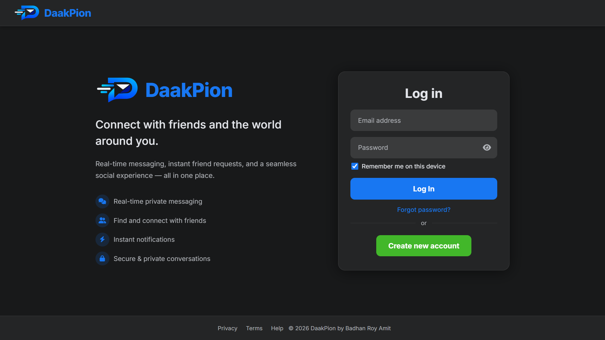
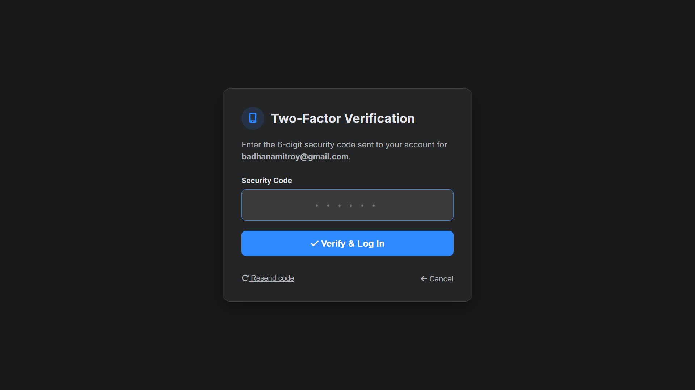
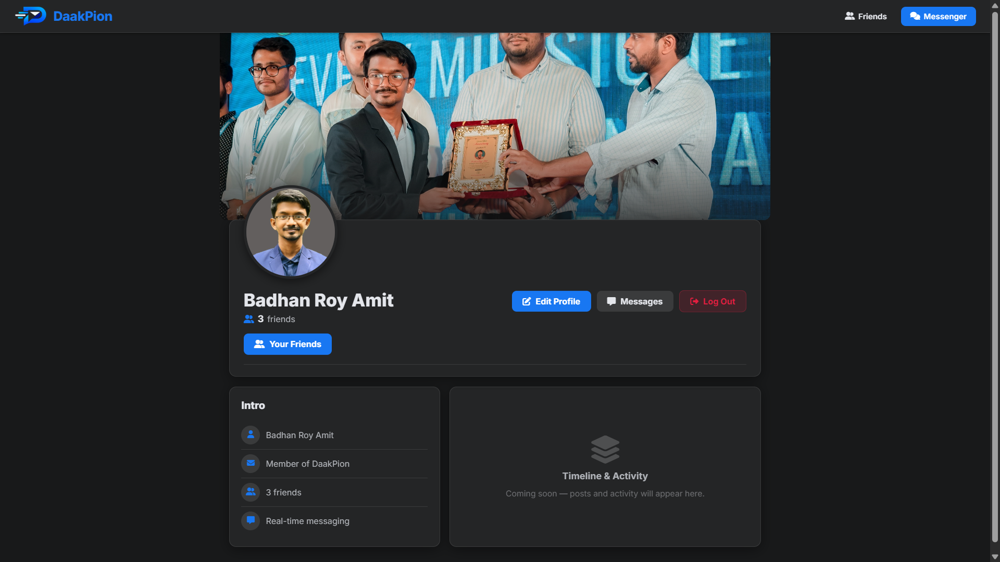
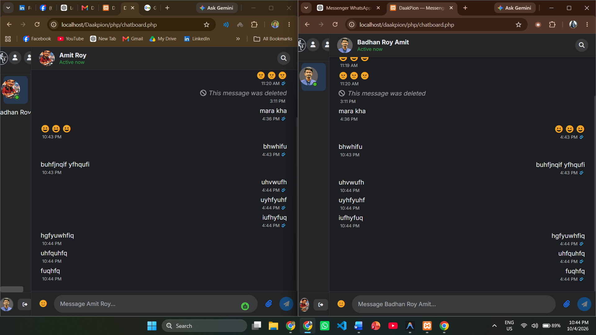
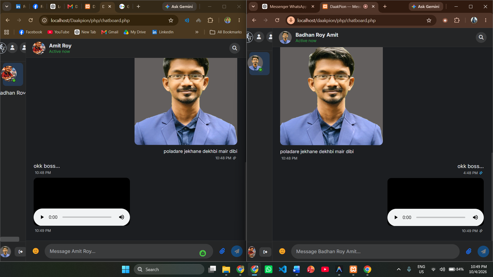

# 🕊️ DaakPion — Real-Time Chat App



> A Facebook-inspired, full-featured real-time chat application built with **PHP**, **MySQL**, **HTML**, **CSS (Inter font + dark mode)**, and vanilla **JavaScript**.

---

## ✨ Features

- 🔐 **User Authentication** — Register, Login, Logout (session-based)
- 💬 **Real-Time Messaging** — Polling-based live chat between friends
- 👥 **Friend System** — Send/Accept/Decline friend requests
- 👤 **User Profiles** — Cover photo, profile picture, friend count
- ✏️ **Edit Profile** — Update name, profile pic, and cover photo
- 🔍 **Search** — Find friends by name on the chat & friends pages
- 📱 **Responsive Design** — Works on desktop, tablet & mobile

---
### OTP Page 


### User Profile 


### live chatting and document sharing betwenn two users. 




## 🎨 Design System

| Element | Value |
|---------|-------|
| **Theme** | Facebook-inspired dark mode |
| **Font** | `Inter` (Google Fonts) |
| **Primary Blue** | `#1877f2` |
| **Messenger Blue** | `#0084ff` |
| **Body BG** | `#18191a` |
| **Card Surface** | `#242526` |

---

## 🛠️ Tech Stack

| Layer | Technology |
|-------|-----------|
| Backend | PHP 8+ |
| Database | MySQL (via XAMPP) |
| Frontend | HTML5, Vanilla CSS, Vanilla JS |
| Icons | Font Awesome 6.5 |
| Server | Apache (XAMPP) |

---

## 🚀 Setup Instructions

### 1. Prerequisites
- [XAMPP](https://www.apachefriends.org/) (Apache + MySQL + PHP)

### 2. Clone the repo
```bash
git clone https://github.com/badhanamitroy/Daak-Pion-Chat-App.git
cd Daak-Pion-Chat-App
```

### 3. Place in XAMPP's web root
```
C:\xampp\htdocs\Daakpion\
```

### 4. Create the database
1. Open **phpMyAdmin** → `http://localhost/phpmyadmin`
2. Create a database named `daakpion` (or your preferred name)
3. Import the SQL schema (if provided) or create tables manually

### 5. Configure DB credentials
Create `php/db_connect.php` (excluded from git for security):
```php
<?php
$conn = new mysqli('localhost', 'root', '', 'daakpion');
if ($conn->connect_error) {
    die('Connection failed: ' . $conn->connect_error);
}
?>
```

### 6. Create upload directories
Make sure these folders exist and are writable:
```
ProfilePics/
Coverpics/
```

### 7. Launch
Open your browser: `http://localhost/Daakpion/`

---

## 📁 Project Structure

```
Daakpion/
├── index.html              # Login / Landing page
├── Register.html           # Registration page
├── homepage.css            # Login page styles
├── Register.css            # Registration styles
├── chatboard.css           # Messenger UI styles
├── user-profile.css        # Profile page styles
├── seepassword.js          # Password toggle
├── css/
│   └── shared-header.css   # Shared navbar styles
├── php/
│   ├── userlogin.php       # Login handler
│   ├── registration.php    # Register handler
│   ├── chatboard.php       # Main chat UI
│   ├── friendlist.php      # Friends page
│   ├── user-profile.php    # Profile page
│   ├── edit-profile.php    # Edit profile page
│   ├── send_message.php    # Send message API
│   ├── get_messages.php    # Fetch messages API
│   ├── send_request.php    # Send friend request
│   ├── respond_request.php # Accept/decline request
│   └── logout.php          # Logout handler
├── ProfilePics/            # User profile pictures (not in git)
└── Coverpics/              # User cover photos (not in git)
```

---

## 📸 Screenshots

> Login Page, Register Page, Chatboard, Friends, Profile — all Facebook dark-mode inspired.

---

## 👨‍💻 Author

**Badhan Roy Amit**  
GitHub: [@badhanamitroy](https://github.com/badhanamitroy)

---

## 📄 License

© 2026 Badhan Roy Amit — All Rights Reserved.
