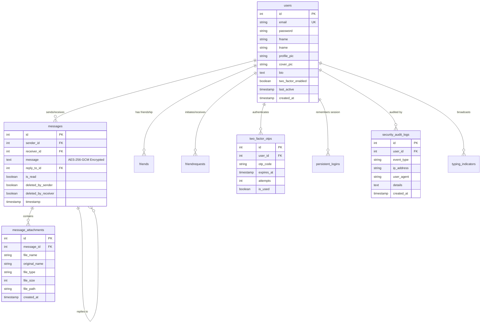

# 🕊️ DaakPion — Secure Real-Time Social Messenger


<p align="center">
  
  
  
  
  
  
</p>

---

## 📖 Overview

**DaakPion** is a modern, high-performance, security-hardened real-time social messaging platform inspired by Facebook and Messenger. Built from the ground up with **PHP 8.2+**, **MySQL**, and **Vanilla JavaScript**, DaakPion merges a responsive dark-mode user experience with an enterprise-grade cryptographic security architecture.

Unlike conventional PHP chat prototypes, DaakPion features **AES-256-GCM message encryption at rest**, **Argon2id password hashing with HMAC pepper**, **Two-Factor Authentication (2FA)** via SMTP OTP, **sliding-window rate limiting**, **persistent split-token authentication**, **contextual message reply threading**, and **comprehensive multimedia attachment sharing** (images, videos, audio, documents, and voice notes).

---

## 📸 Visual Showcase & Demos

### 💬 Live Chatting & Document Sharing Between Users
Experience frictionless real-time messaging with live polling, read receipts (`✓` / `✓✓`), contextual reply threads, attachment previews, and instant deletion options.


---

### 🔐 Two-Factor Authentication (OTP Security)
State-of-the-art authentication flow with cryptographically secure 6-digit numeric OTPs dispatched via SMTP, real-time client countdown timers, progressive rate limiting, and brute-force lockouts.


---

### 👤 User Profile & Social Identity
Rich personal profile suite with dynamic cover photo upload, profile avatar management (with automatic fallback to `dp.png`), editable bio, friendship statistics, and account security controls.


---

## ✨ Comprehensive Feature Matrix

### 🔐 1. Advanced Authentication & Security
- **Argon2id Hashing with HMAC-SHA256 Pepper**: High-entropy password storage immune to GPU/ASIC rainbow attacks.
- **Two-Factor Authentication (2FA)**: Mandatory or optional email-based 6-digit OTP verification with 10-minute expiry windows and a 5-attempt brute-force threshold.
- **Persistent "Remember Me" Login**: Secure split-token architecture (`selector:validator`) using SHA-256 hashed validators for 30-day persistent sessions.
- **Double-Submit Cookie CSRF Guard**: Cryptographically random 32-byte tokens checked on all state-altering POST requests.
- **Sliding-Window Rate Limiter**: Multi-tier throttling for logins, OTP requests, and messaging to counter DDoS and credential stuffing.
- **Tamper-Evident Audit Logging**: Dual-layer auditing (MySQL database + structured filesystem logs) tracking security, auth, and data events with client IP and user-agent metadata.
- **Hardened HTTP Headers**: Comprehensive Content-Security-Policy (CSP), Strict-Transport-Security (HSTS), X-Frame-Options (DENY), and X-Content-Type-Options (nosniff).

### 💬 2. Real-Time Messaging & Conversation Engine
- **Low-Latency Polling Pipeline**: Adaptive 3-second polling cycles fetching only new deltas since the latest synced message ID.
- **Message Encryption at Rest**: Sensitive message payloads are encrypted with AES-256-GCM authenticated cipher with unique initialization vectors (IV).
- **Reply Threading**: Contextual quoting of previous messages with one-click navigation to parent messages.
- **Granular Message Deletion**:
  - *Delete for Me*: Soft-deletes the message locally for the calling user.
  - *Delete for Everyone*: Permanently retracts the message for both participants (within a 15-minute grace period).
- **Delivery & Read Receipts**: Visual status checkmarks (`✓` Sent, `✓✓` Delivered/Read) tracked per message.
- **Real-Time Typing Indicators**: Ephemeral typing heartbeats stored with 5-second staleness auto-expiration.
- **Active Presence & Online Heartbeat**: Live user presence tracked via 30-second ping cycles.
- **Unread Notification Badges & Search**: Dynamic unread counter badges and real-time conversation filtering.

### 📎 3. Rich Multimedia & File Attachments
- **Multi-Format Support**:
  - 📷 **Images**: JPEG, PNG, GIF, WEBP with inline thumbnail preview and lightbox modal.
  - 🎥 **Videos**: MP4, WEBM with native inline media playback.
  - 🎵 **Audio**: MP3, WAV, OGG with custom player controls.
  - 🎙️ **Voice Notes**: In-browser microphone recording via the HTML5 `MediaRecorder` API.
  - 📄 **Documents**: PDF, DOC, DOCX, TXT, ZIP with file size display and secure download triggers.
- **Upload Hardening**: Strict MIME-type validation via PHP `finfo`, file extension whitelisting, randomized UUID storage names, and execution-blocked upload directories via `.htaccess`.

### 👥 4. Social Graph & Friendship System
- **User Discovery & Search**: Global user search with friendship status indicators.
- **Friend Requests Workflow**: Send, accept, or decline friend requests with real-time UI updates.
- **Mutual Friends List**: Dedicated friend list view displaying current online status and fast direct-message action buttons.

### 🎨 5. UI/UX & Design System
- **Facebook Messenger Dark Theme**: Deep dark aesthetics (`#18191a` background, `#242526` surface cards, `#3a3b3c` dividers).
- **Clean Typography**: Powered by Google Fonts `Inter` with modern micro-interactions.
- **Responsive Layout**: Fluid breakpoints optimized for mobile, tablet, and ultra-wide displays.

---

## 🛡️ Security Architecture Deep Dive

```
                                  [ Incoming Request ]
                                           │
                                           ▼
                            ┌─────────────────────────────┐
                            │   php/bootstrap_security.php│
                            └──────────────┬──────────────┘
                                           │
         ┌─────────────────────────────────┼─────────────────────────────────┐
         │                                 │                                 │
         ▼                                 ▼                                 ▼
┌──────────────────┐             ┌──────────────────┐             ┌──────────────────┐
│  SecurityHeaders │             │   CryptoService  │             │   RateLimiter    │
│  CSP, HSTS, CORS │             │ Pepper Validation│             │ IP & Action Lock │
└──────────────────┘             └──────────────────┘             └──────────────────┘
                                           │
         ┌─────────────────────────────────┼─────────────────────────────────┐
         │                                 │                                 │
         ▼                                 ▼                                 ▼
┌──────────────────┐             ┌──────────────────┐             ┌──────────────────┐
│   CsrfService    │             │  SessionManager  │             │   AuditLogger    │
│ Token Validation │             │ Strict Session   │             │ DB + File Logs   │
└──────────────────┘             └──────────────────┘             └──────────────────┘
```

| Security Component | Mechanism / Algorithm | Implementation File |
|--------------------|-----------------------|---------------------|
| **Password Hashing** | `Argon2id` (memory: 64MB, time: 4, threads: 2) + HMAC-SHA256 Pepper | `php/Security/PasswordHasher.php` |
| **Payload Encryption** | `AES-256-GCM` with 96-bit random IV & 128-bit authentication tag | `php/Security/CryptoService.php` |
| **CSRF Defense** | Cryptographic token matching via Double-Submit Cookie & Header checks | `php/Security/CsrfService.php` |
| **Two-Factor Auth** | 6-digit CSPRNG numeric code, 10-min TTL, 5-attempt lockout | `php/Security/OtpService.php` |
| **Remember Me** | Split-token pattern (`selector` + `SHA-256(validator)`) | `php/Security/AuthService.php` |
| **Rate Limiter** | Sliding window counter with exponential backoff & IP lockdown | `php/Security/RateLimiter.php` |
| **Attachment Safety** | `mime_content_type()` inspection, extension whitelist, UUID filenames, `.htaccess` deny rules | `php/Security/AttachmentService.php` |
| **Security Auditing** | Tamper-evident logging to `security_audit_logs` & `logs/security.log` | `php/Security/AuditLogger.php` |

---

## 🗄️ Relational Database Schema

The database consists of **12 interconnected tables** optimized for high-volume chat operations:



### Table Directory
1. **`users`**: Account credentials, profile assets, bio, 2FA status, and online activity timestamps.
2. **`messages`**: Encrypted text messages, sender/receiver references, reply context, read receipts, and soft-delete flags.
3. **`message_attachments`**: Attachment metadata, MIME types, file sizes, and UUID storage paths.
4. **`friends`**: Active bi-directional friend connections.
5. **`friendrequests`**: Pending and historical friend requests with sender/receiver IDs and request status.
6. **`typing_indicators`**: Live typing activity between chat pairs with self-expiring timestamps.
7. **`two_factor_otps`**: Active 6-digit OTP verification codes with attempt throttling.
8. **`persistent_logins`**: Split-token remember-me persistent session storage.
9. **`password_resets`**: Password recovery verification tokens.
10. **`security_rate_limits`**: Sliding-window hit counters indexed by IP address and action scope.
11. **`security_audit_logs`**: Permanent log of critical security events (logins, failures, password changes).
12. **`system_config`**: Dynamic application configuration variables.

---

## 🛠️ Technology Stack

| Domain | Technology / Library | Role & Details |
|--------|----------------------|----------------|
| **Backend Engine** | PHP 8.2+ | Object-oriented security architecture, strictly typed handlers |
| **Database** | MySQL 8.0+ / MariaDB | Relational persistence with foreign keys, InnoDB, utf8mb4 collation |
| **Frontend Core** | Vanilla JavaScript (ES6+) | Asynchronous fetch polling, DOM manipulation, media recording |
| **Styling & Theme** | Modern CSS3 (Vanilla) | Custom properties, dark-mode color palette, responsive flex/grid |
| **Typography** | Google Fonts `Inter` | Clean, modern sans-serif typography |
| **Iconography** | Font Awesome 6.5 Free | Vector interface icons |
| **Mail Dispatcher** | PHPMailer / Native SMTP | Secure TLS/SSL email delivery for 2FA OTP codes |
| **Web Server** | Apache (XAMPP / Production) | `mod_rewrite`, `mod_headers`, and `.htaccess` protection |

---

## 🚀 Step-by-Step Installation Guide

### 1. Prerequisites
- **Web Server**: [XAMPP](https://www.apachefriends.org/) (Recommended for local dev) or Apache/Nginx with PHP 8.2+.
- **PHP Extensions Required**: `pdo_mysql`, `mysqli`, `openssl`, `sodium`, `mbstring`, `fileinfo`, `curl`.
- **Database**: MySQL 8.0+ or MariaDB 10.4+.

---

### 2. Clone the Repository
Clone the project into your local web root directory:
```bash
# For Windows XAMPP:
cd C:\xampp\htdocs
git clone https://github.com/badhanamitroy/Daak-Pion-Chat-App.git Daakpion
cd Daakpion
```

---

### 3. Database Setup
1. Launch **Apache** and **MySQL** from your XAMPP Control Panel.
2. Open your browser and navigate to **phpMyAdmin**: `http://localhost/phpmyadmin/`.
3. Create a new database named `daakpion` with collation `utf8mb4_unicode_ci`.
4. Import the database schema from `docs/schema.sql` (or execute your database migration script).

---

### 4. Configuration Setup
Create or update your database and application configuration in `php/db_connect.php` and `php/app_config.php`:

#### `php/db_connect.php`:
```php
<?php
$host = 'localhost';
$user = 'root';
$pass = '';
$dbname = 'daakpion';

$conn = new mysqli($host, $user, $pass, $dbname);
if ($conn->connect_error) {
    die("Database Connection Failed: " . $conn->connect_error);
}
$conn->set_charset("utf8mb4");
?>
```

#### `php/app_config.php` (Security & SMTP settings):
```php
<?php
return [
    'app_name' => 'DaakPion',
    'app_url'  => 'http://localhost/Daakpion',
    
    // Cryptographic Keys (generate with bin2hex(random_bytes(32)))
    'pepper_key'     => 'YOUR_64_CHAR_HEX_PEPPER_KEY',
    'encryption_key' => 'YOUR_64_CHAR_HEX_MESSAGE_ENCRYPTION_KEY',

    // SMTP Configuration for 2FA OTP Delivery
    'smtp' => [
        'host'       => 'smtp.gmail.com',
        'port'       => 587,
        'username'   => 'your-email@gmail.com',
        'password'   => 'your-app-specific-password',
        'encryption' => 'tls',
        'from_email' => 'no-reply@daakpion.com',
        'from_name'  => 'DaakPion Security Team'
    ]
];
?>
```

---

### 5. Directory Permissions
Ensure that the upload, avatar, and log directories exist and have proper write permissions:
```bash
# Windows PowerShell:
mkdir ProfilePics, Coverpics, uploads, logs -ErrorAction SilentlyContinue
```
*(On Linux/macOS, execute `chmod -R 775 ProfilePics Coverpics uploads logs` and ensure `www-data` ownership).*

---

### 6. Launch Application
Navigate to your local instance in any modern browser:
```
http://localhost/Daakpion/
```
1. Register a new account at `Register.html`.
2. Check your mailbox for the 2FA OTP code.
3. Start real-time encrypted messaging with friends!

---

## 📁 Project Directory Structure

```
Daakpion/
├── .htaccess                      # Global security rules & HTTP headers
├── index.html                     # Login & Landing page
├── Register.html                  # User registration page
├── chatboard.html                 # Messenger interface markup
├── user-profile.html              # User profile page markup
├── edit-profile.html              # Profile editing page markup
│
├── css/
│   ├── homepage.css               # Landing & login styling
│   ├── Register.css               # Registration view styling
│   ├── chatboard.css              # Messenger UI, bubbles & drawer styles
│   ├── user-profile.css           # Profile, headers & card styles
│   ├── edit-user-profile.css      # Settings & edit profile styling
│   ├── friendlist.css             # Friends list & search styling
│   └── shared-header.css          # Global navigation bar styling
│
├── js/
│   ├── chatboard.js               # Real-time polling, attachments, reply handler
│   ├── otp.js                     # 2FA code input & countdown timer
│   └── seepassword.js             # Password toggle visibility
│
├── php/
│   ├── bootstrap_security.php     # Central security initialization & fail-closed check
│   ├── app_config.php             # Core app config, keys, & SMTP credentials
│   ├── db_connect.php             # MySQL database connection initialization
│   ├── userlogin.php              # Login authentication handler
│   ├── registration.php           # User signup & password hashing handler
│   ├── verify_otp.php             # 2FA code verification endpoint
│   ├── resend_otp.php             # 2FA code generation & re-dispatch
│   ├── chatboard.php              # Authenticated chat session router
│   ├── send_message.php           # Encrypted message dispatch API
│   ├── get_messages.php           # Real-time delta message fetcher API
│   ├── delete_message.php         # Delete for Me / Everyone handler
│   ├── typing_indicator.php       # Ephemeral typing indicator API
│   ├── upload_attachment.php      # Attachment validation & UUID storage handler
│   ├── user-profile.php           # User profile rendering & stats
│   ├── edit-profile.php           # Profile info & photo upload handler
│   ├── friendlist.php             # Friends list & directory query
│   ├── send_request.php           # Friend request dispatch API
│   ├── respond_request.php        # Friend request accept/decline API
│   ├── logout.php                 # Secure session destruction & token flush
│   │
│   └── Security/                  # Enterprise Security Class Suite (Namespace: Daakpion\Security)
│       ├── CryptoService.php      # AES-256-GCM encryption & pepper validation
│       ├── PasswordHasher.php     # Argon2id + HMAC-SHA256 hashing engine
│       ├── CsrfService.php        # Double-Submit Cookie CSRF validation
│       ├── RateLimiter.php        # Sliding-window IP & account rate limiter
│       ├── AuditLogger.php        # Database & filesystem audit logger
│       ├── SessionManager.php     # Strict session lifecycle manager
│       ├── Sanitizer.php          # XSS sanitization & input escaping
│       ├── AttachmentService.php  # MIME inspection & secure upload validator
│       ├── OtpService.php         # 6-digit numeric OTP generator & verifier
│       ├── MailerService.php      # SMTP transaction handler
│       ├── AuthService.php        # Remember-me split-token manager
│       └── SecurityHeaders.php    # CSP, HSTS, and frame protection headers
│
├── ProfilePics/                   # Stored user avatars (fallback: dp.png)
├── Coverpics/                     # Stored profile cover banners
├── uploads/                       # Secure attachment store (protected with .htaccess)
└── logs/                          # Security & error audit logs
```

---

## 🔌 API & Endpoint Reference

| Endpoint | Method | Auth | Description |
|----------|--------|------|-------------|
| `php/userlogin.php` | `POST` | Public | Authenticates credentials; routes to 2FA OTP if enabled |
| `php/registration.php` | `POST` | Public | Validates and creates a new user account |
| `php/verify_otp.php` | `POST` | Session | Verifies 6-digit 2FA OTP code and completes login |
| `php/resend_otp.php` | `POST` | Session | Generates and sends a new OTP with rate limiting |
| `php/get_messages.php` | `GET` | User | Polls messages between friends with delta caching |
| `php/send_message.php` | `POST` | User | Encrypts and persists a new text or reply message |
| `php/upload_attachment.php` | `POST` | User | Validates and stores multimedia attachments |
| `php/delete_message.php` | `POST` | User | Handles soft-deletion (for me) or hard retract (for everyone) |
| `php/typing_indicator.php` | `POST` | User | Updates or clears live typing state |
| `php/send_request.php` | `POST` | User | Sends a new friend request |
| `php/respond_request.php` | `POST` | User | Accepts or declines an incoming friend request |
| `php/logout.php` | `GET/POST` | User | Invalidates session and clears persistent remember-me tokens |

---

## 🗺️ Roadmap & Planned Enhancements

- [x] AES-256-GCM Message Encryption at Rest
- [x] Argon2id Password Hashing with HMAC Pepper
- [x] Two-Factor Authentication via SMTP Email OTP
- [x] Multimedia File Sharing & In-browser Voice Notes
- [x] Contextual Reply Threading & Read Receipts
- [x] Dual-mode Message Deletion (For Me vs. Everyone)
- [ ] **WebSockets / Server-Sent Events (SSE)**: Transition from polling to bidirectional persistent socket streams.
- [ ] **Group Chats & Channels**: Multi-user rooms with granular administration permissions.
- [ ] **Social Feed & Timeline**: User posts, status updates, photo shares, and friend comments.
- [ ] **Audio/Video Calls**: Peer-to-peer WebRTC calling integration.
- [ ] **End-to-End Encryption (E2EE)**: Client-side Web Crypto API key generation and message locking.

---

## 👨‍💻 Author

**Badhan Roy Amit**
- **GitHub**: [@badhanamitroy](https://github.com/badhanamitroy)
- **Project Repository**: [Daak-Pion-Chat-App](https://github.com/badhanamitroy/Daak-Pion-Chat-App)

---

## 📄 License & Attribution

This project is licensed under the terms of the MIT License — see the [LICENSE](LICENSE) file for details.

*Crafted with passion for secure, real-time web engineering.*
